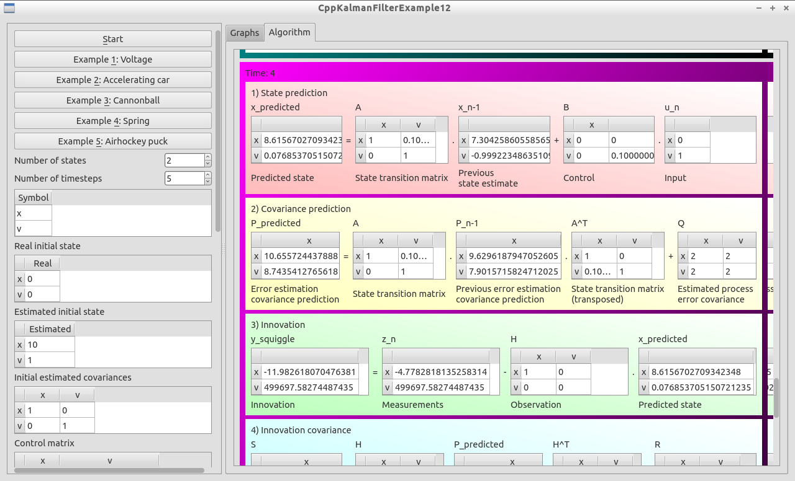

# KalmanFilterExample12

[Kalman filterer example](https://github.com/richelbilderbeek/KalmanFilterExamples) that displays the equations.

# External links

 * [KalmanFilterer](https://github.com/richelbilderbeek/KalmanFilterer): tool to explore and work with Kalman filters

